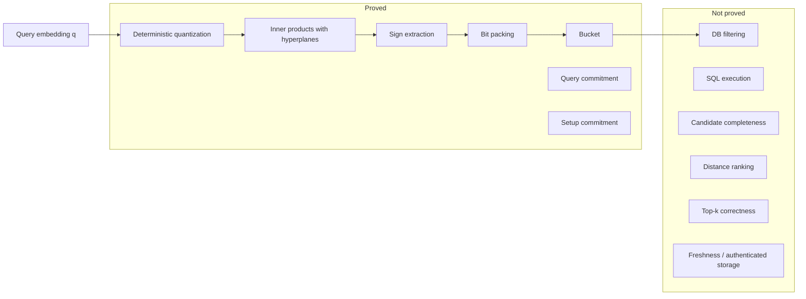
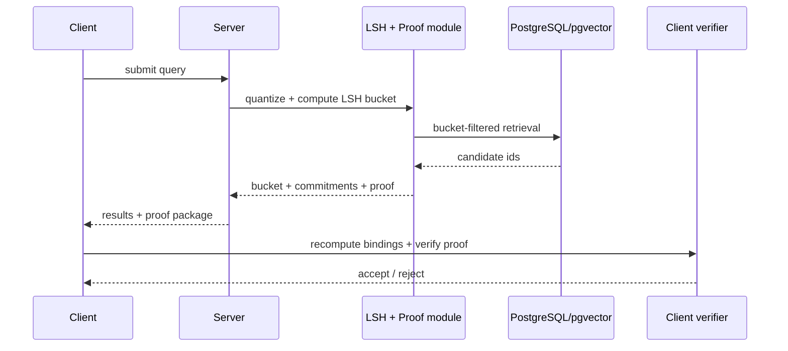
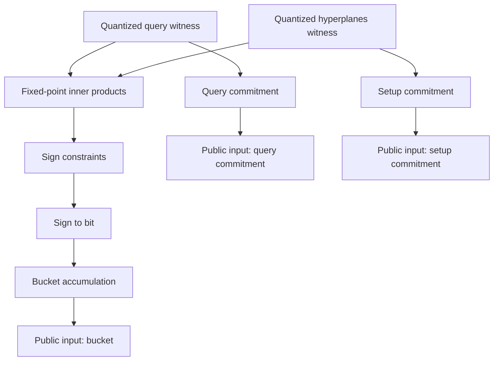

# Verifiable LSH for Private Vector Databases

## Proving candidate-generation integrity in semantic search

Semantic search is usually easy to use and hard to audit.

A client sends a query embedding, a remote service runs indexing and candidate generation, and the client only sees the final result. My thesis asks a narrower question: **can an untrusted server produce machine-checkable evidence that the reported LSH bucket was computed correctly, without revealing the database?** The prototype, **VerifyESearch**, answers this for random-hyperplane LSH using a deterministic quantization bridge, a Halo2 circuit, PostgreSQL + pgvector, and client-side verification. The proved statement is intentionally narrow: it certifies **bucket derivation**, not global nearest-neighbor optimality, ranking correctness, freshness, or candidate completeness.

> [!IMPORTANT]
> This project does **not** prove that the final returned item is the globally best result in the full database.
>
> It proves something narrower but operationally meaningful:
> **the LSH bucket was derived correctly from the query under the agreed setup and arithmetic model.**

---

## Why this exists

Modern vector retrieval is usually deployed as a remote service:

- the client sends a query
- the server computes candidate generation
- the server ranks and returns a result
- the client cannot inspect the internal retrieval path

That creates a trust gap. The client may get a plausible answer, but still has no way to know whether the server used the expected index, the expected hyperplanes, or even the intended computation path. That is exactly the gap this project tries to reduce.

---

## The exact claim

Given:

- a query vector $q$
- a fixed set of hyperplanes $\{w_i\}_{i=0}^{m-1}$

the server proves that the exported bucket is the result of:

1. deterministic quantization
2. inner-product evaluation against the agreed hyperplanes
3. sign extraction
4. sign-to-bit conversion
5. bit packing into the final bucket
6. binding to public commitments for query and setup

Formally, for random-hyperplane LSH:

$$
h_{w_i}(q) =
\begin{cases}
1 & \text{if } \langle w_i, q \rangle \ge 0 \\
0 & \text{if } \langle w_i, q \rangle < 0
\end{cases}
$$

and the bucket is reconstructed as

$$
\mathrm{bucket}(q)=\sum_{i=0}^{m-1} 2^i \, h_{w_i}(q)
$$

This matches the proof boundary described in the thesis: the system proves correct bucket derivation under a shared quantized arithmetic model, while leaving ranking, SQL execution, returned ids, top-$k$ correctness, and freshness out of scope.

---

## Proof boundary



---

## Why LSH is a good proof target

I focused on **random-hyperplane LSH** because its computation decomposes into operations that are relatively friendly to arithmetic circuits:

- inner products
- sign constraints
- bit conversion
- weighted accumulation

Compared with graph-based ANN structures, this is much easier to encode and reason about in Halo2. The thesis explicitly motivates LSH for this reason: its internal computation is algebraically simple enough to be a realistic target for verifiable encoding.

For angular similarity, the hash family also has a clean geometric interpretation:

$$
\Pr[h_w(x)=h_w(y)] = 1 - \frac{\theta}{\pi}
$$

where $\theta$ is the angle between $x$ and $y$. Nearby vectors collide more often, which makes LSH useful as a candidate-generation mechanism.

---

## End-to-end architecture



The runtime architecture is split into two aligned paths:

- a **retrieval path**, which computes the bucket and retrieves candidates from storage
- a **proof path**, which reconstructs the same bucket computation under Halo2 and returns verifier-facing metadata and proof material

So the proof subsystem complements retrieval; it does not replace it.

---

## The hard part: floating point vs finite fields

The retrieval pipeline naturally lives in floating-point arithmetic.

Halo2 does not.

That mismatch is one of the central technical problems in the thesis: the off-circuit system starts from real-valued embeddings and hyperplanes, while the circuit can only reason over field elements. The solution is a **deterministic fixed-point quantization bridge** shared across preprocessing, witness generation, and verification.

Let $B=\texttt{PREC\_BITS}$ and let

$$
S = 2^B
$$

Then each real-valued coordinate $x$ is quantized as

$$
\tilde{x} = \operatorname{round}(x \cdot S)
$$

and dequantized as

$$
\hat{x} = \frac{\tilde{x}}{S}
$$

with per-coordinate error bounded by

$$
|x-\hat{x}| \le \frac{1}{2S}
$$

This becomes the arithmetic contract for the whole system:

- query preprocessing
- hyperplane encoding
- witness generation
- circuit arithmetic
- verifier recomputation
- public bindings

### Minimal Rust sketch

```rust
const PREC_BITS: u32 = 16;
const SCALE: i64 = 1 << PREC_BITS;

fn quantize(value: f64) -> i64 {
    (value * SCALE as f64).round() as i64
}

fn dequantize(value: i64) -> f64 {
    value as f64 / SCALE as f64
}
```

---

## From query to bucket

Conceptually, the off-circuit logic is extremely simple:

```ts
function innerProduct(a: number[], b: number[]): number {
  let sum = 0;
  for (let i = 0; i < a.length; i += 1) {
    sum += a[i] * b[i];
  }
  return sum;
}

function lshBucket(query: number[], hyperplanes: number[][]): number {
  let bucket = 0;

  for (let i = 0; i < hyperplanes.length; i += 1) {
    const dot = innerProduct(query, hyperplanes[i]);
    const bit = dot >= 0 ? 1 : 0;
    bucket |= bit << i;
  }

  return bucket;
}
```

The circuit version is more constrained, but semantically it follows the same path.

---

## Halo2 circuit design

The Halo2 side is organized around three reusable components:

- **FixedPointInnerProductChip**
- **SignChip**
- **RangeCheckChip**

The top-level LSH circuit then adds:

- sign-to-bit conversion
- bucket accumulation
- public-input binding

This is exactly how the thesis structures the circuit: fixed-point arithmetic first, then sign enforcement, then reconstruction of the final bucket and commitments.

### Core algebraic constraints

#### 1. Sign membership

The sign witness must be in $\{+1,-1\}$:

$$
s_i^2 - 1 = 0
$$

#### 2. Sign consistency with the projection

If $p_i$ is the quantized inner product, the chip introduces

$$
t_i = s_i \cdot p_i
$$

and then range checks a scaled version of $t_i$ so that the sign has an order-like meaning inside the field.

#### 3. Sign-to-bit conversion

The bit is derived from the sign through the affine relation

$$
2b_i = s_i + 1
$$

So:

- $s_i = +1 \Rightarrow b_i = 1$
- $s_i = -1 \Rightarrow b_i = 0$

#### 4. Bucket accumulation

The final bucket is reconstructed as

$$
\mathrm{bucket}=\sum_{i=0}^{m-1} 2^i b_i
$$

---

## Circuit pipeline



---

## What the verifier actually checks

A subtle but important point is that the verifier is not just checking a bucket in isolation.

The proof instance is bound to public values such as:

- the bucket
- the query commitment
- the setup commitment

So the claim is not merely:

> there exists some witness that produces some bucket

It is closer to:

> there exists a witness consistent with **this** query/setup context that produces **this** bucket

This matters because it prevents context substitution attacks: a valid proof for one computation cannot simply be replayed in a different query/setup context if the public bindings do not match.

---

## Quantization stability

One of the most useful empirical questions was:

> how often does quantization actually change the bucket?

On the evaluated workload, the observed mismatch rate between floating-point LSH and quantized LSH was:

| `PREC_BITS` | mismatch rate |
| ----------: | ------------: |
|           8 |    `0.007812` |
|          12 |    `0.003906` |
|          16 |           `0` |
|          20 |           `0` |

So `PREC_BITS = 16` was the smallest tested precision with **zero observed disagreement** on the workload used in the evaluation. The thesis is careful about the interpretation: this validates the **numerical bridge**, not retrieval quality in the ANN sense.

The sign-stability intuition is:

$$
|p_i| > |\delta_i| \;\Longrightarrow\; \operatorname{sign}(\hat{p}_i)=\operatorname{sign}(p_i)
$$

where $\delta_i$ is the projection perturbation introduced by quantization. The unstable region is near zero: one sign flip is enough to change one bit, and one bit flip is enough to change the final bucket.

---

## Benchmark snapshot

The performance result is equally clear: **the prototype is prover-bound**.

| Benchmark         | Mean (s) |
| ----------------- | -------: |
| `setup_init`      |  `45.31` |
| `proof_create`    |  `70.71` |
| `proof_verify`    |   `2.14` |
| `e2e_mock`        |   `7.70` |
| `e2e_real_verify` | `158.25` |

Interpretation:

- verification is relatively cheap
- proof generation dominates
- the full proof-enabled path is much more expensive than the mock path
- the main bottleneck is prover cost, not database size or network overhead

This is also the main conclusion of the thesis discussion: verification is practical, proof generation is the deployment bottleneck.

---

## What I find most interesting

What I like most about this project is not just that a proof verifies.

It is that the system forces a clean separation between:

- what the client can trust
- what the server may lie about
- what is public
- what stays private
- what guarantee is actually exported to the user

That turns “ZK for search” from a slogan into a concrete guarantee boundary.

---

## Limitations

> [!WARNING]
> The current proof boundary is intentionally narrow.

The prototype does **not** guarantee:

- global nearest-neighbor correctness
- top-$k$ correctness
- candidate completeness
- SQL/ranking correctness
- embedding-model correctness
- authenticated freshness of the database

A malicious server could still manipulate later retrieval stages while returning a valid proof for the bucket step. That is not a flaw in the proof; it is a consequence of the chosen scope boundary.

---

## Final takeaway

This thesis is about attaching **cryptographic integrity** to a concrete subcomputation inside vector retrieval.

The main outcome is:

- verifiable random-hyperplane LSH bucket derivation is implementable in Halo2
- a deterministic fixed-point bridge is sufficient to align retrieval and circuit arithmetic
- client-side verification is affordable
- prover cost is the real obstacle to deployment

That is why I consider the project successful: it does not solve all of verifiable search, but it makes one non-trivial piece of it concrete, measurable, and honest about its boundary.

## Stack

```text
Rust
Halo2
PostgreSQL
pgvector
Random-hyperplane LSH
Deterministic fixed-point quantization
Client-side proof verification
```

## One-line summary

> **VerifyESearch proves that an untrusted server computed the LSH bucket for a query correctly under a shared quantized arithmetic model, without revealing the private retrieval state.**
